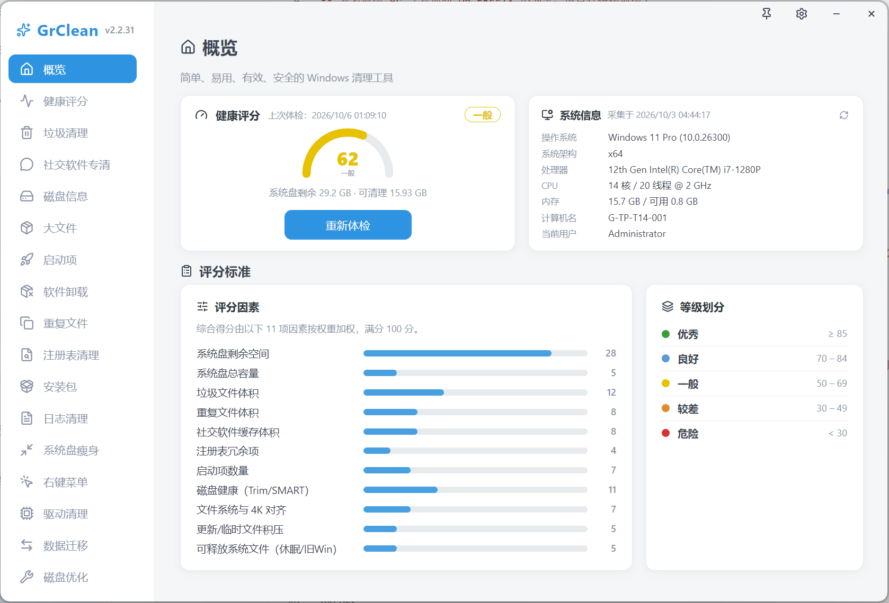
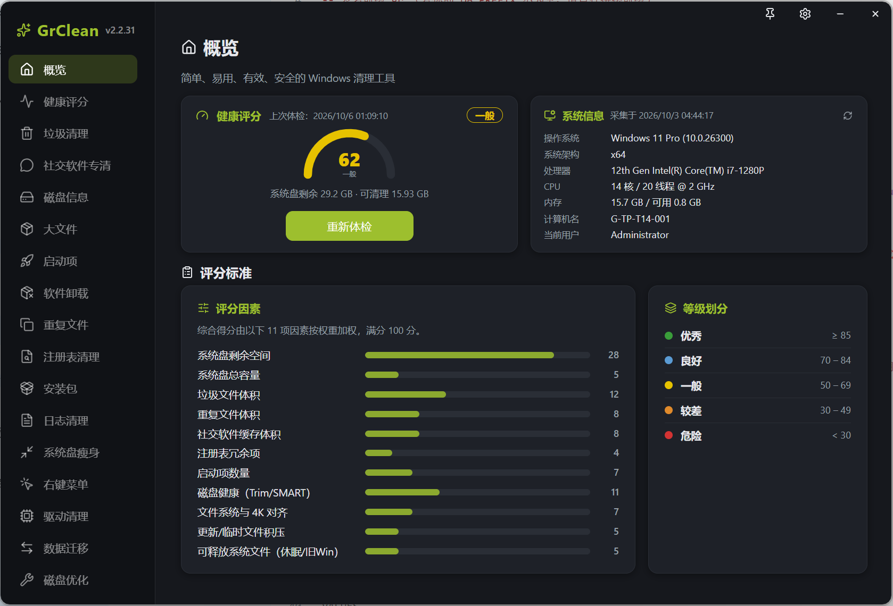
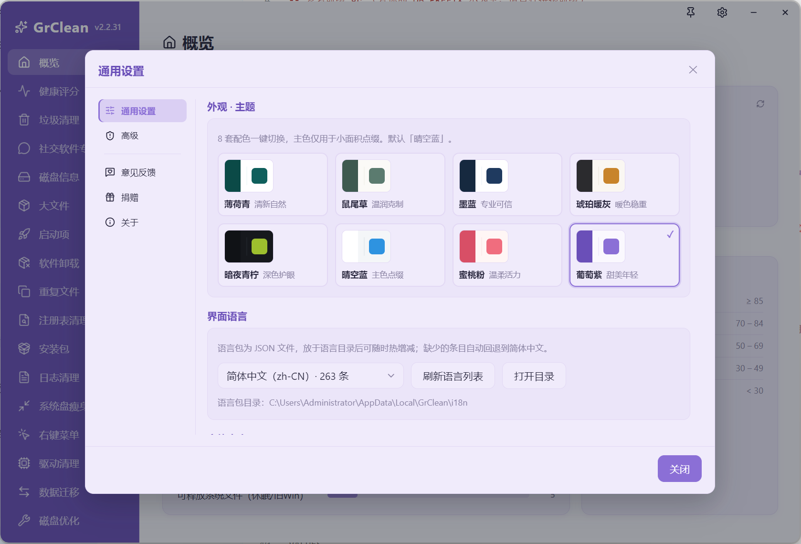
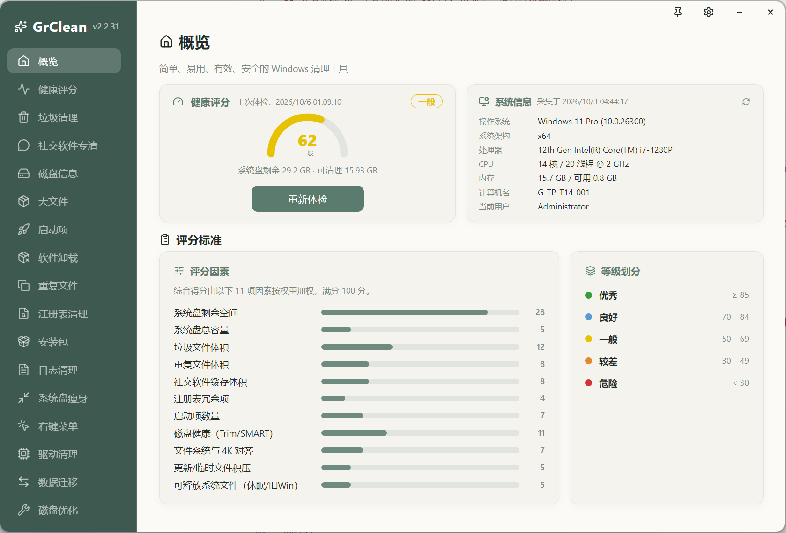
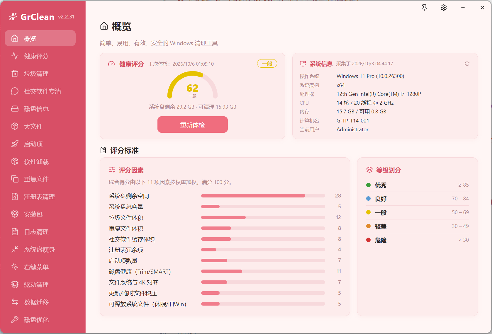

<h1 align="center">GrClean</h1>

<p align="center">Windows 清理与系统优化工具 · Electron + Vue3 + TypeScript</p>

<p align="center">


</p>

## 功能特性

GrClean 是一款免费、开源的 Windows 清理与系统优化工具。它是一款原生 Electron 桌面客户端，配合轻量 PHP 后端提供版本/更新及内容分发。

核心能力：

- 🧹 **垃圾清理** —— 系统、浏览器与软件缓存、临时文件，内置安全的默认扫描范围规则。
- 💬 **社交软件专清** —— 微信 / QQ / 企业微信等：清理缓存图片、文件与临时数据。**绝不触碰聊天记录**（这是我们的硬性承诺之一）。
- 📦 **大文件分析** —— 找出各磁盘上最大的文件，释放空间。
- 👯 **重复文件查找** —— 按哈希找出重复文件并清理冗余副本。
- 🚀 **启动项管理** —— 审查并禁用不需要的开机启动项。
- 🗑 **卸载残留** —— 检测软件卸载后的残留项。
- 🧩 **注册表清理** —— 谨慎、基于规则的注册表清理（启发式，绝不激进）。
- 💿 **安装包清理** —— 清理孤立的安装包 / 安装程序残留。
- 📜 **日志清理** —— 清理随时间长大的系统与软件日志。
- 💽 **磁盘与驱动管理** —— 按磁盘查看、SMART 健康概览、驱动清单。
- 🩺 **健康度评分** —— 加权计算的电脑健康评分，并给出清晰可执行的建议。
- 🔄 **迁移 / 搬家** —— 将占用空间大的文件夹迁移到其它盘。
- ⚡ **系统优化** —— 一键优化，让系统更流畅。
- 🪶 **系统精简** —— 剥离不需要的可选 Windows 组件。
- 🕑 **计划任务** —— 浏览并管理 Windows 任务计划项。
- 🖱 **右键菜单管理** —— 增删右键菜单项。
- ♻ **回收站管理** —— 列举并清理回收站项目。
- 🔧 **软件卸载** —— 内置卸载并附带残留扫描。
- 📸 **系统快照** —— 保存 / 还原系统状态点。
- 📋 **清理规则** —— 可自定义的清理规则。
- 🎨 **8 套主题** 与 **全局字号缩放** 设置。
- 🌐 **9 种内置语言**（简体中文 / 英文 / 繁体中文 / 日文 / 韩文 / 法文 / 德文 / 西班牙文 / 俄文）。

## 截图展示

概览（首页）—— 健康度评分、系统信息与 11 项加权评分明细：

<table>
  <tr>
    <td width="50%"></td>
    <td width="50%"></td>
  </tr>
  <tr>
    <td align="center"><sub>薄荷青 · Light</sub></td>
    <td align="center"><sub>暗夜青柠 · Dark</sub></td>
  </tr>
</table>

### 主题

内置 8 套主题，一键切换（强调色仅作用于窗口外观与控件，默认为晴空蓝）：

<p align="center">
  
</p>

同一界面在其它几套主题下的效果：

<table>
  <tr>
    <td width="50%"></td>
    <td width="50%"></td>
  </tr>
  <tr>
    <td align="center"><sub>鼠尾草 · Sage</sub></td>
    <td align="center"><sub>蜜桃粉 · Peach</sub></td>
  </tr>
</table>

## 技术栈

- **Electron** 28
- **Vue 3** + **TypeScript** 5
- **Vite** 5（基于 **electron-vite** 2，main / preload / renderer 同仓管理）
- **electron-builder** 24（NSIS 安装包 + 便携版，Windows x64）
- **Lucide** 图标

## 项目搭建

### 安装依赖

```bash
npm install
```

> `postinstall` 脚本会执行 `electron-builder install-app-deps`。在 Windows 上还会从 `.npmrc` 配置的镜像拉取 Electron 二进制文件。

### 开发模式

```bash
npm run dev
```

### 类型检查

```bash
npm run typecheck
```

### 构建

```bash
# Windows 安装包 + 便携版（未签名）
npm run build:win

# Windows 安装包 + 便携版（已签名 —— 需要代码签名证书）
npm run build:win:signed

# macOS
npm run build:mac

# Linux
npm run build:linux
```

构建产物位于 `dist/`（已被 git 忽略）。

### 代码签名（Windows）

`electron-builder.yml` 已预配置 `signingHashAlgorithms: [sha256]` 与 DigiCert RFC3161 时间戳服务器。要产出已签名的构建，需要 OV/EV 代码签名证书，可通过以下任一方式提供：

- `win.certificateSubjectName` / `win.certificateSha1`（证书存储或 EV 令牌），或
- `CSC_LINK`（+ `CSC_KEY_PASSWORD`）指向 `.pfx` 文件。

构建前可执行 `npm run sign:check` 校验签名环境是否就绪。

## 项目结构

```
src/
  main/        Electron 主进程（engine/、ipc/、index.ts）
    engine/    纯 TS+Node 的扫描 / 清理引擎（流式生成器）
    ipc/       IPC 处理（scan-*:start 流式 + 一次性 handle）
  preload/     预加载桥接（类型化的 window.api，安全封装）
  renderer/    Vue 3 界面（views/、components/、stores/、assets/）
build/         应用图标 + macOS 权限声明
resources/     打包内资源（如 windows-trash 辅助程序）
scripts/       构建 / 发布辅助脚本（签名检查、图标生成、字号缩放）
```

## 下载与链接

- 官方网站：<https://gr.graent.cn/grclean>
- 最新发布：GitHub 的 **Releases** 页面（安装版 `.exe` + 便携版 `.exe`）。

## 捐赠

如果这个工具帮到了你，可以 **请作者喝杯奶茶** 🧋。捐赠完全自愿，不影响任何功能。

### 收款码

<table>
  <tr>
    <td width="50%" align="center"></td>
    <td width="50%" align="center"></td>
  </tr>
  <tr>
    <td align="center"><sub>微信收款码</sub></td>
    <td align="center"><sub>支付宝收款码</sub></td>
  </tr>
</table>

### 交流社区

<table>
  <tr>
    <td width="50%" align="center"></td>
    <td width="50%" align="center"></td>
  </tr>
  <tr>
    <td align="center"><sub>微信公众号</sub></td>
    <td align="center"><sub>QQ 交流群</sub></td>
  </tr>
</table>

## 协议 / 许可

GrClean 可免费用于 **非商业用途**，包括但不限于 **个人使用、教学使用以及安全研究**。版权所有 © Graent。保留所有权利。

使用或获取本软件即表示你同意以下限制：

- 🚫 **禁止商业化** —— 不得将其用于任何商业目的，包括但不限于销售、转售、捆绑，或任何其它付费及商业行为。
- 🚫 **禁止二次分发** —— 不得重新发布、镜像，或通过任何其它渠道提供本软件。
- 🚫 **禁止去除或篡改** —— 不得移除、隐藏或修改软件或本仓库中的任何版权声明、作者信息或完整性 / 校验信息（包括内置的文件完整性校验）。

如需商业授权或任何形式的合作，请直接联系作者。

同时，我们也**欢迎你提出改进建议或意见** —— 欢迎提交 Issue 或随时联系。

> 本项目不另行附带 `LICENSE` 文件，以上条款即为许可协议。
